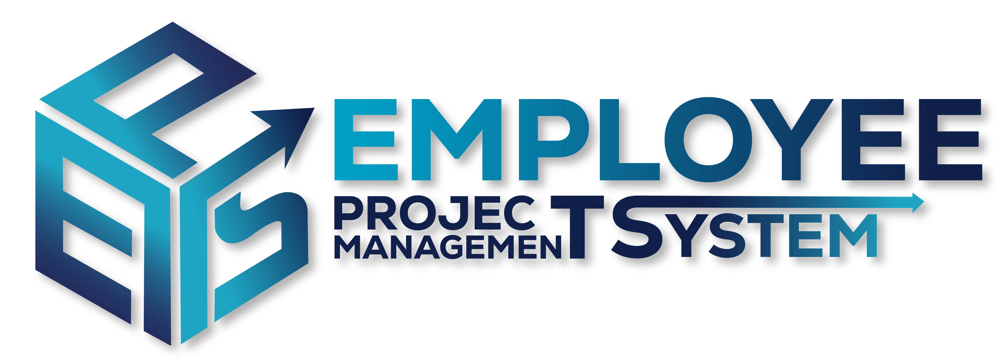

<div align="center">
  

# 
### $$\color{#01a0c6}{\mathsf{\text{A High-Performance Python GUI for Tracking Workflows}}}$$
</div>


<pre>
 ██████   ██████  ██████      ███████ ██ ███    ██  █████  ██          ██████  ██████   ██████       ██ ███████  ██████ ████████
██    ██ ██    ██ ██   ██     ██      ██ ████   ██ ██   ██ ██          ██   ██ ██   ██ ██    ██      ██ ██      ██         ██   
██    ██ ██    ██ ██████      █████   ██ ██ ██  ██ ███████ ██          ██████  ██████  ██    ██      ██ █████   ██         ██   
██    ██ ██    ██ ██          ██      ██ ██  ██ ██ ██   ██ ██          ██      ██   ██ ██    ██ ██   ██ ██      ██         ██   
 ██████   ██████  ██          ██      ██ ██   ████ ██   ██ ███████     ██      ██   ██  ██████   █████  ███████  ██████    ██   
                                                                                                                                
                                                                                                                                
                 ██████ ▄▄   ▄▄ ▄▄▄▄  ▄▄     ▄▄▄  ▄▄ ▄▄ ▄▄▄▄▄ ▄▄▄▄▄   █████▄ ▄▄▄▄   ▄▄▄    ▄▄ ▄▄▄▄▄  ▄▄▄▄ ▄▄▄▄▄▄                
                 ██▄▄   ██▀▄▀██ ██▄█▀ ██    ██▀██ ▀███▀ ██▄▄  ██▄▄    ██▄▄█▀ ██▄█▄ ██▀██   ██ ██▄▄  ██▀▀▀   ██                  
                 ██▄▄▄▄ ██   ██ ██    ██▄▄▄ ▀███▀   █   ██▄▄▄ ██▄▄▄   ██     ██ ██ ▀███▀ ▄▄█▀ ██▄▄▄ ▀████   ██                  
                                                                                                                                
          ██▄  ▄██  ▄▄▄  ▄▄  ▄▄  ▄▄▄   ▄▄▄▄ ▄▄▄▄▄ ▄▄   ▄▄ ▄▄▄▄▄ ▄▄  ▄▄ ▄▄▄▄▄▄   ▄█████ ▄▄ ▄▄  ▄▄▄▄ ▄▄▄▄▄▄ ▄▄▄▄▄ ▄▄   ▄▄         
          ██ ▀▀ ██ ██▀██ ███▄██ ██▀██ ██ ▄▄ ██▄▄  ██▀▄▀██ ██▄▄  ███▄██   ██     ▀▀▀▄▄▄ ▀███▀ ███▄▄   ██   ██▄▄  ██▀▄▀██         
          ██    ██ ██▀██ ██ ▀██ ██▀██ ▀███▀ ██▄▄▄ ██   ██ ██▄▄▄ ██ ▀██   ██     █████▀   █   ▄▄██▀   ██   ██▄▄▄ ██   ██         
</pre>


<p align="center">
  
  
  
</p>

</div>

---
<div align="center">
  <h2>👥 The Development Team 👥</h2>
  <p>
<p align="center">
  <b>Ian Paulo Lisud</b> • <b>Jesse Matthew Esteta</b> • <b>Jiro Luis Katindig</b><br>
  <b>Francis Elijah Formalejo</b> • <b>Marqui Cenar</b>
</p>

---

**📌 Overview**   
The Productivity Management System is a command-line based application designed to help users efficiently manage their tasks, projects, and overall productivity. It allows users to create accounts, track personal and group projects, monitor progress, and log distractions to improve focus and performance.  
  
The system supports both solo and collaborative workflows, enabling users to work independently or as part of a team. With built-in features such as deadlines, task assignment, and project tracking, the application helps users stay organized and meet their goals effectively.  
  

---
<div align="center">
  <h2>⚙️ Core Modules ⚙️</h2>
  <p>
<table align="center">
  <tr>
    <td align="center"><b>🔐 Authentication.py</b><br>Secure login logic & session handling</td>
    <td align="center"><b>🖥️ Dashboard.py</b><br>Main GUI window & user interface</td>
  </tr>
  <tr>
    <td align="center"><b>💾 Database.py</b><br>Local JSON storage & data CRUD</td>
    <td align="center"><b>🛠️ Config.py</b><br>System constants & global settings</td>
  </tr>
</table>

---
<div align="center">
  <h2>✨ Key Features ✨</h2>
  <p>
## 
- 🚀 **Tkinter Interface:** A native desktop experience with responsive `ttk` widgets.
- 🆔 **UUID Integrity:** Every task and project is tracked with unique universal identifiers.
- 📊 **Progress Monitoring:** Real-time completion updates for both solo and group projects.
- 📅 **Deadline Tracking:** Integrated `datetime` calculations for urgent task prioritization.
- 📂 **Persistent Storage:** Data remains intact across sessions via local file-handling.

---
<div align="center">
  <h2>🛠️ Built With 🛠️</h2>
  <p>
<p align="center">
  
</p>
<p align="center">
  <i>Standard Libraries: <code>tkinter</code>, <code>uuid</code>, <code>datetime</code>, <code>json</code></i>
</p>

---
<div align="center">
  <h2>🚀 Getting Started 🚀</h2>
  <p>
```bash```
1. Clone the Repository
Copy the project files from GitHub to your computer:
```bash
git clone https://github.com/TIPLisud/Productivty-Tracker-Group-6-.git
```
2. Navigate to the Source
Move into the project folder and enter the source directory where the GUI logic resides:
```bash
cd productivity-tracker/Productivity_Tracker
```
3. Launch the Application
Run the main script using Python 3
    On windows:
```bash
py Main.py
```
   On Mac/Linux:
```bash
python3 Main.py
```

---
<div align="center">
  <h2>📦 Prerequisites 📦</h2>
  <p>
- Python 3.8+
- Tkinter library (Included in most Python installations)
- Git
---
